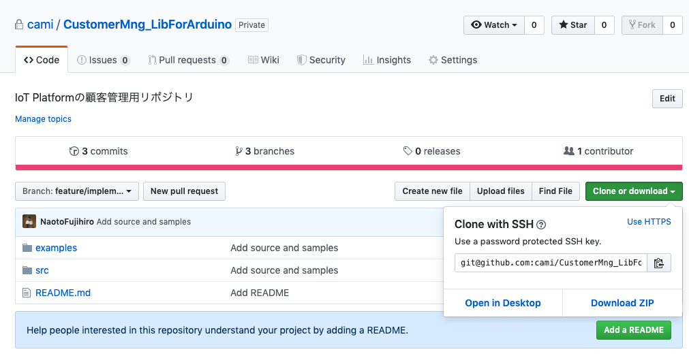

# Customer Management tools for Nectis

`IoT Platform` の顧客管理システム

With this library, you can create the sketch and invoke SORACOM API for Customer Management.

## Login to SORACOM account

Visit [SORACOM](https://console.soracom.io/#/signup?coverage_type=jp)

| key | value |
| :----- | :----- |
| Email address | iot_dx_soracom@cami.jp |
| Password | CAMI573190dx |

`Operator` is `iot_dx_soracom@cami.jp`.
Make `Group` corresponding to the `Customers`.

To manage `Group`, please read [here](https://dev.soracom.io/jp/docs/api_guide/) carefully.

## Login to AWS account

| key | value |
| :----- | :----- |
| Email address | aws+IoTPlatform@cami.jp |
| Password | Q$Jw2Mahqh |

1. To update the firmware automatically, use AWS lambda.

[update_firmware_if_necessary](https://ap-northeast-1.console.aws.amazon.com/lambda/home?region=ap-northeast-1#/functions/update_firmware_if_necessary?newFunction=true&tab=graph)

2. To put the board info into AWS DynamoDB, use AWS lambda.

[put_payload_to_dynamodb](https://ap-northeast-1.console.aws.amazon.com/lambda/home?region=ap-northeast-1#/functions/put_payload_to_dynamodb?tab=graph)

3. To receive the data from SORACOM and allocate them appropriately, use AWS IoT Core.

[sIoTamago](https://ap-northeast-1.console.aws.amazon.com/iot/home?region=ap-northeast-1#/rulehub)

4. To srote and query the board and customer info, use AWS DynamoDB.

[CustomerManagement](https://ap-northeast-1.console.aws.amazon.com/dynamodb/home?region=ap-northeast-1#tables:)

## Usage

1. Download this repo as ZIP file.

2. In order to use from the sketch, place this library into the following path.

`ArduinoCore-nRF52840/libraries`

3. In order to invoke SORACOM API using Python3, set up the environment as follows.

[SetUp](docs/Setup_Environment/README.md)

## Policy for Customer Management

[README](docs/CustomerManagement_Policy/CustomerMngt-Policy.md)

## Procedure

1. 基板検査

[Inspection.md](docs/Procedure/Inspection.md)

2. 顧客情報の登録

[Register.md](docs/Procedure/Register.md)

3. 出荷前パッケージング

[Shipping.md](docs/Procedure/Shipping.md)

4. OTA-DFU

[Ota_Dfu.md](docs/Procedure/Ota_Dfu.md)

5. SORACOM Lagoonのアカウント管理

[Laggon.md](docs/Procedure/Lagoon.md)

6. 請求書管理

[Billing.md](docs/Procedure/Billing.md)

7. 解約手続き

[Cancellation.md](docs/Procedure/Cancellation.md)

